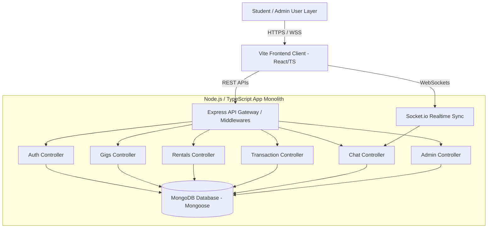
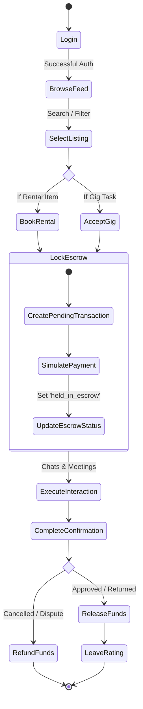
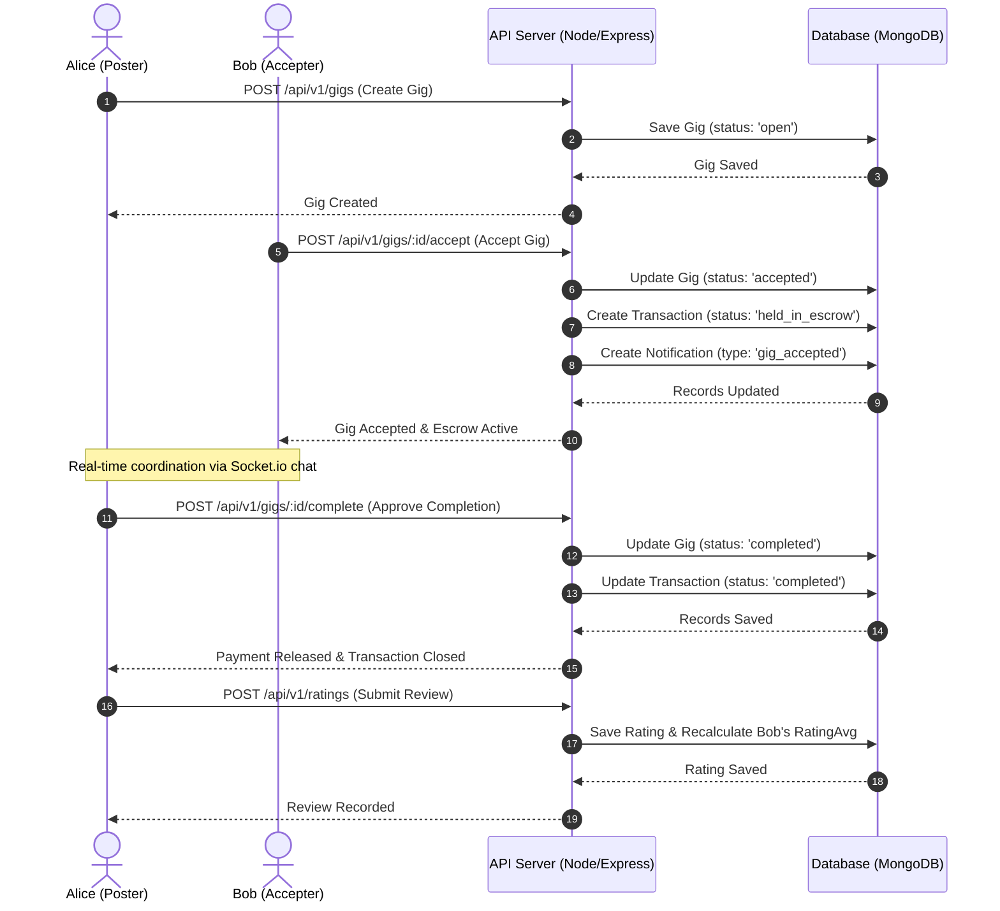
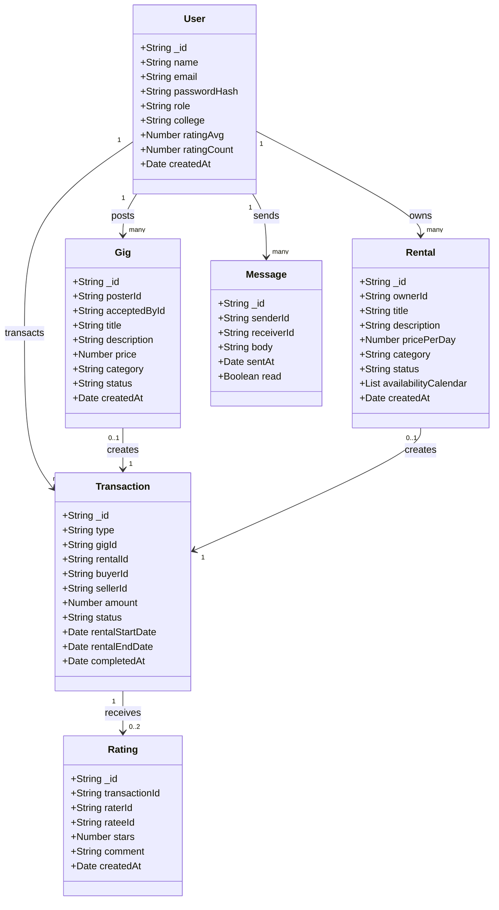
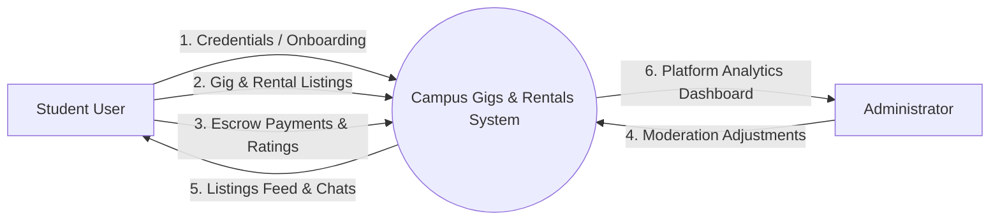
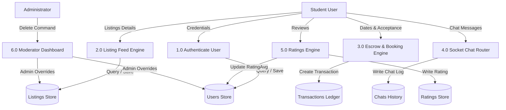

# COLLEGE PROJECT REPORT
## CAMPUS GIGS & RENTALS: A PEER-TO-PEER MARKETPLACE FOR COLLEGE STUDENTS

---

### 1. TITLE PAGE
* **Project Title:** Campus Gigs & Rentals
* **Domain:** Peer-to-Peer Collaborative Consumption & Micro-Task Economy
* **Academic Session:** 2025 - 2026
* **Submitted By:** University Computer Science Department Undergraduate Candidates
* **Platform Target:** Responsive Web Application (React, Node.js, Socket.io, MongoDB)

---

### 2. CERTIFICATE OF ORIGINALITY
This is to certify that the project work entitled **"Campus Gigs & Rentals"** is a bonafide record of work carried out by the student group in partial fulfillment of the requirements for the degree of Bachelor of Technology in Computer Science & Engineering. The content of this report is original and has not been submitted elsewhere for any other degree or credential.

---

### 3. ACKNOWLEDGEMENT
We express our deep gratitude to our project guide, faculty advisors, and the Head of the Computer Science Department for their invaluable mentorship, technical guidance, and constructive feedback throughout the design, implementation, and testing phases of this application. We also thank our peers who participated in the UI evaluations and testing simulations.

---

### 4. ABSTRACT
Colleges represent dense communities with high demand for short-term tasks (gigs) and temporary resources (textbooks, calculator gear, event supplies). However, students lack a secure, exclusive peer-to-peer portal to transact safely. This project implements **Campus Gigs & Rentals**, a web application enabling students to list micro-gigs, lend or borrow items, hold transaction funds securely in simulated escrow, and chat in real-time. Using a modern stack of **React, TypeScript, Node.js, Socket.io, and MongoDB**, the platform verifies registrations against university email domains (.edu) and provides administrators with moderation controls. Detailed UML diagrams, schema entities, and automated integration test results are included to validate the architectural design.

---

### 5. TABLE OF CONTENTS
1. Introduction & Background
2. Problem Statement & Objectives
3. System Requirement Specification (SRS)
4. UML & Software Engineering Diagrams
5. Database Design (ERD & Schemas)
6. Implementation & Directory Layout
7. Testing & Verification
8. Future Scope & Conclusion
9. References

---

### 6. INTRODUCTION & BACKGROUND
The sharing economy has transformed global transport and lodging, yet hyper-local campus environments remain underserved. Student directories or social forums lack structured search filters, message threads, or transaction ledgers. This project introduces a dedicated peer-to-peer marketplace structured around two core hubs:
1. **Gig Portal**: Allows students to post micro-tasks (tutoring, lifting, moving, club flyers design) with transparent budgets.
2. **Rentals Hub**: Promotes collaborative lending of textbooks, sports gear, scientific calculators, and dorm accessories.

Authenticity is verified via college email domain verification (.edu), and mutual accountability is maintained through feedback reviews and ratings.

---

### 7. PROBLEM STATEMENT & OBJECTIVES

#### Problem Statement
Students face resource challenges due to the cost of buying items that are only needed temporarily (e.g. lab equipment, calculators) and a lack of access to flexible on-campus work. Existing bulletin boards are unorganized and lack security, resulting in issues like unpaid tasks, late returns, and fraudulent listings.

#### Project Objectives
* **College Domain Verification**: Restrict signups to students with university email domains.
* **Escrow Transaction Management**: Develop a mock payment ledger that locks funds in escrow until both parties confirm completion.
* **Real-time Synchronization**: Integrate instant Socket.io chat updates and in-app notifications.
* **Listing Discovery**: Implement categorization, search indexing, and range pricing filters.
* **Platform Moderation**: Provide administrators with dashboard metrics and account/listing moderation tools.

---

### 8. SYSTEM REQUIREMENT SPECIFICATION (SRS)

#### Functional Requirements
* **Authentication**: Signup using `.edu` email address, password hashing, and login token dispatches.
* **Gigs Module**: Create, search, filter, accept, cancel, and complete micro-tasks.
* **Rentals Module**: Create, search, filter, date-block book, and return items.
* **Transaction Module**: Simulate checkout, manage transaction ledger, and execute escrow logic.
* **Chat Module**: Handle direct messaging, read receipts, and typing indicators.
* **Notification Module**: Send real-time socket events and in-app notifications.
* **Admin Module**: Provide system dashboard analytics, metrics, and listing moderation.

#### Non-Functional Requirements
* **Security**: Enforce JWT authentication, bcrypt password hashing, and role restrictions.
* **Performance**: Under 100ms response times for chat events.
* **Scalability**: Clean modular monolith structure prepared for microservices.
* **Usability**: Premium dark mode design with Tailwind responsive grids.

---

### 9. UML & SOFTWARE ENGINEERING DIAGRAMS

#### 9.1 System Architecture Diagram


#### 9.2 Use Case Diagram
```mermaid
left_to_right_direction
actor Student
actor Admin

rectangle "Campus Gigs & Rentals System" {
  Student --> (Register / Log In)
  Student --> (Post Gig Listing)
  Student --> (Accept Gig Task)
  Student --> (Rent Item Listing)
  Student --> (Borrow Item via Calendar)
  Student --> (Send Real-time Chats)
  Student --> (Complete Transaction Escrow)
  Student --> (Leave Rating / Review)

  Admin --> (Moderate Users Accounts)
  Admin --> (Moderate Listings / Gigs / Rentals)
  Admin --> (View System Analytics Dashboard)
}
```

#### 9.3 Activity Diagram (Login to Completion Flow)


#### 9.4 Sequence Diagram (Gig Transaction Lifecycle)


#### 9.5 Class Diagram


#### 9.6 Component Diagram
```mermaid
component Style {
  [Tailwind CSS & CSS Directives]
}
component FrontendClient {
  [App Router & Guards] --> [Browse Component]
  [App Router & Guards] --> [Chat Workspace]
  [App Router & Guards] --> [Profile Ledger]
  [App Router & Guards] --> [Admin Dash]
  [Browse Component] --> [Redux RTK Store]
  [Browse Component] --> [React Query APIs]
  [Chat Workspace] --> [Socket.io Client]
}
component BackendAPI {
  [Express Middlewares] --> [Auth Router]
  [Express Middlewares] --> [Gigs Router]
  [Express Middlewares] --> [Rentals Router]
  [Express Middlewares] --> [Transaction Router]
  [Express Middlewares] --> [Chat Router]
  [Express Middlewares] --> [Admin Router]
  
  [Chat Router] --> [Socket.io Server]
  [Gigs Router] --> [Notification Service]
}
database "MongoDB Storage" {
  [Mongoose Schemas]
}
FrontendClient -->|JSON REST| BackendAPI
BackendAPI --> [Mongoose Schemas]
```

#### 9.7 Data Flow Diagram (DFD Level 0 & Level 1)
##### Level 0 - Context DFD


##### Level 1 - Process DFD


---

### 10. DATABASE DESIGN
The database is implemented in **MongoDB** using **Mongoose ORM** schemas. Below are the key document definitions matching the ER diagram.

* **Users Collection**: Stores student profiles, rating statistics, and hashed credentials. Unique index on `email`.
* **Gigs Collection**: Stores micro-task budgets, classifications, and status fields (`open`, `accepted`, `completed`, `cancelled`).
* **Rentals Collection**: Stores equipment descriptions, pricing, and an array of booked date strings (`availabilityCalendar`) in YYYY-MM-DD format.
* **Transactions Collection**: Logs buyer/seller pairs, type, amount, date boundaries, and status (`pending`, `held_in_escrow`, `completed`, `cancelled`).
* **Messages Collection**: Stores real-time chat text logs with timestamp markers.
* **Ratings Collection**: Records star ratings (1-5) and comment details.
* **Notifications Collection**: Tracks unread events pushed to student UI panels.

---

### 11. TECHNOLOGY STACK
* **Frontend**: React 18, TypeScript, Tailwind CSS, Redux Toolkit (global state), TanStack React Query (server cache syncing), React Router v6, Axios, Socket.io-client.
* **Backend**: Node.js, Express.js, TypeScript, Mongoose (MongoDB ORM), Socket.io (WebSocket channels), JWT (jsonwebtoken), bcryptjs.
* **Containerization & Dev Env**: Docker, Docker Compose, Vitest, Jest, Supertest, Playwright.

---

### 12. METHODOLOGY & IMPLEMENTATION

#### Code Quality Principles
1. **SOLID Principles**: Controllers handle requests, models define data, and separate services manage notifications and socket messaging.
2. **Clean Architecture**: System states flow inward through middlewares to route controller services.
3. **Repository Pattern / MVC**: MVC architecture patterns structure backend router controllers.
4. **Shared Schema Types**: Centralized typing avoids discrepancies.

---

### 13. RESULTS & FUTURE SCOPE

#### Testing Outcomes
Automated integration tests verify signup flows, credentials checking, gig creation, calendar reservations, and ratings averaging.

#### Future Scope
* **Real Payment Gateway Integration**: Connect checkout endpoints to Stripe or PayPal API sandboxes.
* **Location-based Search**: Order listing feeds by distance using geospatial queries.
* **Microservices Split**: Split Auth, Gigs, and Rentals into individual Docker containers communicating via RabbitMQ.
